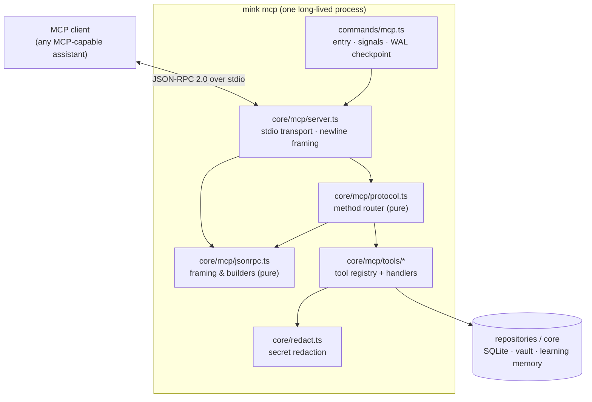
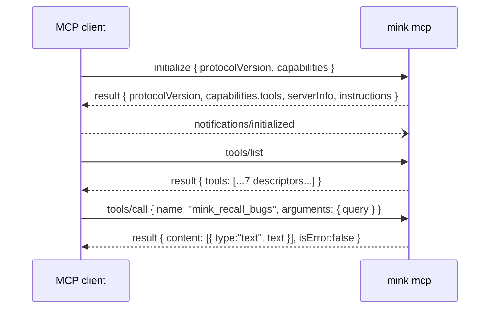

# Mink MCP Server — Architecture & Design

> Status: implemented (spec 24, phases 1–3). This document is the authoritative
> engineering reference for the `mink mcp` server: its architecture, wire
> protocol, tool catalog, security model, operational behaviour, and extension
> points. The technology-agnostic capability contract lives in
> [`specs/24-mcp-server.md`](../specs/24-mcp-server.md).

## 1. Purpose & positioning

Mink has two ways to put its knowledge in front of an AI coding assistant:

- **Push** — lifecycle *hooks* (read/write/tool events) inject context and
  compress oversized tool output as the assistant works. The assistant does not
  ask; Mink decides.
- **Pull** — the *MCP server* exposes Mink's per-project state as
  [Model Context Protocol](https://modelcontextprotocol.io) tools, so an
  MCP-capable assistant can fetch exactly the context it needs, on demand.

Push pays a token cost on Mink's schedule whether or not the information is
needed. Pull lets the assistant retrieve the right few hundred tokens at the
moment it needs them — the single largest real token lever, and the reason this
surface exists. The two are complementary: hooks remain the default; the MCP
server adds precision retrieval and, uniquely, a **write** path so the assistant
can capture notes and log bugs back into Mink.

Because MCP is host-agnostic, this one server works with any MCP-capable client
with zero per-host adapter code, complementing the multi-agent adapter (spec 21).

## 2. Design principles

The server inherits Mink's house constraints, which shaped every decision below:

| Principle | Consequence in this design |
|---|---|
| **Zero new runtime dependencies** | JSON-RPC 2.0 and the MCP method subset are hand-rolled (~200 LOC), not pulled from an SDK. Survives `bun build` into both the Node and Bun bundles unchanged. |
| **Dual runtime (Node + Bun)** | Transport uses only `node:stream` events; no runtime-specific I/O. Verified green under both. |
| **Reversible / honest** | `mink_retrieve` returns byte-exact originals; a miss is a graceful message, never data loss. |
| **Non-blocking, never crash the caller** | Per-request failures become JSON-RPC errors or `isError` results; the loop stays alive. The process never `process.exit`s on a request. |
| **Local-first & safe to sync** | Write tools redact secrets before persistence; the compression cache stays local and is never injected into context. |
| **Prompt-cache stability** | Tool descriptors and results are deterministic, so re-issuing the same call does not perturb a cached prefix. |

## 3. Architecture

The server is layered strictly from pure logic outward to I/O. Each inner layer
is unaware of the one outside it, which is what makes the protocol and tools
exhaustively testable without spawning a process.



### Module responsibilities

| Module | Kind | Responsibility |
|---|---|---|
| `core/mcp/jsonrpc.ts` | pure | JSON-RPC 2.0 types, parse (never throws), structural validation, id extraction, success/error builders, serialize. |
| `core/mcp/tool-types.ts` | pure | The `McpTool` contract, `ToolContext`, argument validators, and the two error channels (`ToolInputError` → `-32602`, `McpToolError` → `isError`). |
| `core/mcp/protocol.ts` | pure* | Deterministic method router: `initialize`, `ping`, `tools/list`, `tools/call`, notifications, error routing. (*Only side effect is invoking a tool handler.) |
| `core/mcp/tools/*` | effectful | One file per tool + a single registry (`tools/index.ts`). Handlers call repositories/core and format results. |
| `core/mcp/server.ts` | I/O | Newline-delimited stdio framing, sequential processing, injectable streams, 16 MiB frame guard. |
| `commands/mcp.ts` | I/O | Long-lived entry point; installs SIGINT/SIGTERM handlers that checkpoint the WAL before exit. |
| `core/redact.ts` | pure | High-precision secret redaction applied on the write path (spec 28 seed). |
| `core/version.ts` | pure | Resolves the running version from the nearest `package.json` for `serverInfo`. |

### Why a hand-rolled transport

Adding the official MCP SDK would introduce the project's first non-trivial
runtime dependency and would have to survive bundling into both the Node and Bun
targets. The server only needs the `initialize` + `tools/*` subset over stdio;
that is a few hundred lines of well-tested pure code. This mirrors the same call
the project already made for its zero-dependency TUI renderer.

## 4. Wire protocol

### Transport framing

MCP's stdio transport is **newline-delimited JSON**: one complete JSON value per
line, no embedded newlines (they are escaped by `JSON.stringify`). The transport:

- accumulates `stdin` chunks and splits on `\n`, reassembling frames that span
  chunk boundaries and flushing a trailing frame with no terminating newline;
- processes frames **sequentially** in arrival order (a local server has one
  client; serializing keeps responses ordered and avoids concurrent writes on
  the same SQLite connection);
- writes each response as its own line to `stdout`;
- reserves `stdout` for protocol frames only — **all diagnostics go to
  `stderr`**;
- guards against an unterminated frame with a 16 MiB ceiling.

### Method matrix

| Method | Kind | Behaviour |
|---|---|---|
| `initialize` | request | Returns `protocolVersion` (negotiated), `capabilities.tools`, `serverInfo`, and `instructions`. |
| `notifications/initialized` | notification | Acknowledged silently (no reply). |
| `notifications/cancelled` | notification | Ignored (no reply). |
| `ping` | request | Returns `{}`. |
| `tools/list` | request | Returns the registry as wire descriptors (`name`, `title`, `description`, `inputSchema`, `annotations`). |
| `tools/call` | request | Validates params, routes to the tool, wraps the result. |
| any other | request | `-32601 Method not found`. |
| any other | notification | Ignored. |

### Version negotiation

Supported versions, newest first: **`2025-06-18`**, **`2024-11-05`**. On
`initialize`, the server echoes the client's requested version when supported,
otherwise offers its latest. The client then decides whether to proceed.

### Error model

Two deliberately distinct channels:

- **Protocol errors** (JSON-RPC `error` object) for problems with the *call*:
  `-32700` parse, `-32600` invalid request, `-32601` method not found, `-32602`
  invalid params (including a malformed argument, caught as `ToolInputError`),
  `-32603` internal error.
- **Tool errors** (`tools/call` result with `isError: true`) for a tool that
  *ran and failed*. The model reads the message and adapts rather than the
  session erroring out.

A "nothing found / graceful miss" (unknown token, no matching bugs, disabled
wiki) is **neither** — it is a normal successful result carrying an explanatory
message, so the assistant is never stranded.

### Handshake sequence



## 5. Tool catalog

Seven tools, delivered across three phases. Read tools are `readOnlyHint`; write
tools redact before persisting.

| Tool | Phase | Kind | Required args | Optional args | Notes |
|---|---|---|---|---|---|
| `mink_retrieve` | 1 | read | `token` | — | Byte-exact original from the spec-22 compression cache; graceful miss on unknown/expired. |
| `mink_recall_bugs` | 2 | read | `query` | `file`, `limit` | FTS5 bug-memory search with root cause, fix, occurrences, match reasons. |
| `mink_search_wiki` | 2 | read | `query` | `limit` | Keyword search over the cross-project vault index; gates when disabled/uninitialized. |
| `mink_file_skeleton` | 2 | read | `path` | — | Signatures/headings with bodies elided; falls back to a one-line description. |
| `mink_project_rules` | 2 | read | — | `section` | Merged learning memory (preferences, learnings, do-not-repeat, decisions). |
| `mink_capture_note` | 3 | write | `body` | `title`, `tags`, `category` | Captures into the vault; derives title from the first line; redacts secrets. |
| `mink_log_bug` | 3 | write | `error`, `file`, `rootCause`, `fix` | `line`, `tags` | Logs a bug; re-logging the same `(error, file)` bumps the occurrence count; redacts secrets. |

## 6. Project scoping

Every stateful capability is reached via `SomeRepo.for(cwd)` or an
`aggregateX(cwd)` call, all keyed off `cwd → projectIdFor(cwd) → projectDir(cwd)`
(spec 20's stable identity resolver). The server captures its launch `cwd` once
and threads it to every handler through `ToolContext`. **Configure the client to
launch `mink mcp` with the working directory set to the project root**, and every
tool resolves against that project's Mink slice. The wiki (`mink_search_wiki`,
`mink_capture_note`) is intentionally global — it spans all projects by design.

## 7. Security model

- **Redaction on write.** `mink_capture_note` and `mink_log_bug` pass all
  model-supplied text through `redactSecrets` before it touches disk, because
  captured content can be synced to a git remote. The redactor is high-precision
  (AWS/GCP/GitHub/Slack keys, private-key blocks, JWTs, bearer tokens,
  secret-ish assignments) and low-false-positive; it is the seed of spec 28,
  which will broaden recall and apply the same pass at every persistence
  boundary.
- **stdout hygiene.** Only protocol frames are written to `stdout`; a stray
  `console.log` would corrupt the stream, so diagnostics are confined to
  `stderr`.
- **Read/write separation.** Read tools carry `readOnlyHint`; the two write
  tools are the only mutating surface and are explicitly non-destructive.
- **Local-only reversible cache.** The compression originals surfaced by
  `mink_retrieve` live in the local SQLite cache, are never synced, and are
  never injected raw into model context.

## 8. Operational behaviour

Unlike Mink's one-shot hook commands, the MCP server is **long-lived**:

- **No `process.exit` per request.** Errors are returned, not fatal.
- **WAL checkpoint on shutdown.** SIGINT/SIGTERM (and normal stream end) trigger
  `checkpointAndCloseAll()` so a concurrent `mink sync` can never stage a torn
  database. (The default DB exit hook only closes handles without
  checkpointing — this command adds the checkpoint.)
- **Bounded work on the request path.** SQLite runs with `busy_timeout=5000`;
  handlers avoid long transactions.
- **Backpressure.** Sequential processing means one in-flight request at a time;
  responses never interleave.

## 9. Client setup

Point any MCP client at the command, with the cwd set to your project root:

```json
{
  "mcpServers": {
    "mink": { "command": "mink", "args": ["mcp"] }
  }
}
```

`mink mcp --help` prints usage. The process speaks JSON-RPC 2.0 on stdio and
runs until the client closes the stream.

## 10. Testing strategy

Coverage is layered to match the architecture (see `tests/unit/mcp/`,
`tests/unit/redact.test.ts`, `tests/integration/mcp-*.test.ts`):

- **Unit — framing (`jsonrpc`).** Parse valid/malformed/non-object frames, id
  validation, request/notification narrowing, builders, single-line
  serialization, id round-trip across all id kinds.
- **Unit — router (`protocol`).** Version negotiation (supported / unknown /
  absent), lifecycle notifications yielding no reply, `ping`, `tools/list`
  shape, `tools/call` routing, the `ToolInputError → -32602` vs
  `McpToolError → isError` split, unknown method/tool, and exact id echo.
- **Unit — transport (`server`).** Blank lines, notifications, parse-error
  frames, batched frames in one chunk, a frame split across chunks, a trailing
  frame with no newline, and an end-to-end tool call over an in-memory stream.
- **Unit — redactor.** Each secret shape masked; context preserved; no false
  positives on prose or short values; deterministic.
- **Integration — tools.** Every tool driven through the full server against
  real state: byte-exact retrieval, bug recall, wiki search, file skeleton,
  merged rules, note capture + index round-trip with on-disk redaction proof,
  bug persistence + occurrence bump + field redaction, and `INVALID_PARAMS`
  paths.

Run: `bun test tests/unit/mcp tests/unit/redact.test.ts tests/integration/mcp-*.test.ts`.

## 11. Extending the server

To add a tool:

1. Create `core/mcp/tools/<name>.ts` exporting an `McpTool` (name, title,
   description, `inputSchema`, `annotations`, `handler`).
2. Validate arguments with the helpers in `tool-types.ts`; throw
   `ToolInputError` for bad input and `McpToolError` for runtime failure; return
   descriptive text for a graceful miss.
3. Register it in `core/mcp/tools/index.ts` (the only wiring point — the build
   picks it up transitively).
4. Add unit/integration tests mirroring the patterns above.

No changes to the transport, protocol, or build are required.

## 12. Forward compatibility

- **Semantic recall (spec 25).** `mink_recall_bugs` and `mink_search_wiki` keep
  their contracts when the FTS5 path gains a local-embedding rank; cross-project
  recall surfaces through the same tools.
- **Full redaction (spec 28).** `core/redact.ts` broadens recall and moves to
  every persistence boundary without changing the write tools' call sites.
- **Cross-project targeting.** An optional `project` argument can resolve via the
  project registry (spec 20) without altering existing single-project behaviour.
```
