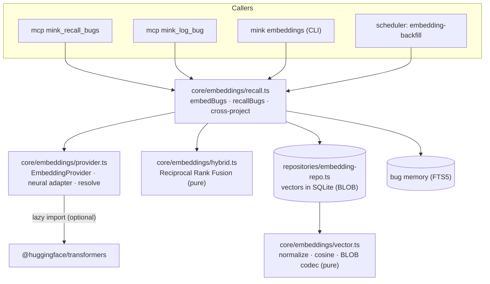

# Mink Semantic Retrieval — Architecture & Design

> Status: implemented (spec 25, phases 1–3) for bug memory. This document is the
> engineering reference for the embedding layer: architecture, the
> optional-dependency decision, data model, hybrid ranking, cross-project
> recall, operational behaviour, and testing. The technology-agnostic contract
> lives in [`specs/25-semantic-retrieval.md`](../specs/25-semantic-retrieval.md);
> the phased delivery plan in
> [`specs/PLAN-semantic-retrieval.md`](../specs/PLAN-semantic-retrieval.md).

## 1. Purpose

Mink's recall was lexical: bug memory is FTS5 (bm25 + a same-file boost), so a
bug is found only when the query shares words with it. Semantic retrieval adds a
vector layer so a bug is found by **meaning** — and, across projects, delivers
the transfer that is the point of a cross-project tool: *"you fixed this same
class of bug in another project — here's how."*

The design is strictly additive. Embeddings **augment** FTS5; they never replace
it. The feature is **off by default**, and whenever it is disabled or the model
is unavailable, recall is exactly today's FTS5 result — there is no regression.

## 2. The optional-dependency decision

Real neural embeddings need a model runtime (`@huggingface/transformers`). Mink's
identity is a lightweight, near-zero-dependency CLI, and CI installs with
`bun install --frozen-lockfile`. Making the runtime a normal (or `optional`)
dependency would download it (and onnxruntime/sharp — hundreds of MB) into every
CI run and every end-user install, and churn the lockfile.

So the runtime is **not a package.json dependency at all**. It is:

- imported lazily through a **non-literal specifier**, so the bundler never
  bundles it and the type-checker never requires it to be installed;
- **user-installed opt-in** (`bun add -g @huggingface/transformers`); and
- **gracefully absent** — a missing library or model surfaces as
  `EmbeddingsUnavailableError`, and every caller falls back to FTS5.

This keeps the base CLI lightweight and CI unaffected, while delivering genuine
neural recall for users who opt in. The model is cached under `~/.mink/models`.

## 3. Architecture



| Module | Kind | Responsibility |
|---|---|---|
| `core/embeddings/vector.ts` | pure | L2 normalize, cosine, portable little-endian Float32 ⇄ bytes codec |
| `core/embeddings/hybrid.ts` | pure | Reciprocal Rank Fusion of ranked lists |
| `core/embeddings/provider.ts` | effectful | `EmbeddingProvider` interface, neural adapter (lazy optional import), `resolveEmbeddingProvider`, test-injection seam |
| `repositories/embedding-repo.ts` | effectful | vector store (BLOB) keyed by `(kind, ref, model)`; brute-force cosine search; `.forDir` for cross-project reads |
| `core/embeddings/recall.ts` | effectful | `embedBugs` (index/backfill) and `recallBugs` (FTS5 ⊕ vectors, plus cross-project) |
| `commands/embeddings.ts` | I/O | `status`/`enable`/`disable`/`backfill` |
| `core/task-registry.ts` | I/O | `embedding-backfill` scheduled task |

The two pure modules carry all the math and fusion logic, so they are
exhaustively unit-tested. Everything above them is verified with an **injected
deterministic provider** (`_setTestEmbeddingProvider`), so the store, hybrid
ranking, and cross-project logic are all proven without the model or a network.

## 4. Data model

```sql
CREATE TABLE embeddings (
  kind         TEXT,     -- 'bug' | 'learning' | 'note'
  ref_id       TEXT,     -- e.g. the bug id
  model        TEXT,     -- provider/model id
  dim          INTEGER,
  vector       BLOB,     -- little-endian Float32, L2-normalized
  content_hash TEXT,     -- hash of the embedded text (backfill freshness)
  created_at   TEXT,
  device_id    TEXT,
  PRIMARY KEY (kind, ref_id, model)
);
```

The vector store is **derived state**: it can always be rebuilt from the source
rows, so it carries `device_id` for audit only and needs no merge semantics.
Keying by `model` lets switching models coexist without corrupting recall — the
reader filters to the active model. `content_hash` lets a backfill skip rows that
are already current and re-embed changed ones.

Search is exact brute-force cosine over the `(kind, model)` candidate set. At
Mink's per-project scale (hundreds to low-thousands of rows) this is well within
the hook budget and avoids a native ANN/`sqlite-vec` dependency; a vector index
is a future optimization behind the same `EmbeddingRepo.search` interface.

## 5. Hybrid ranking

FTS5 bm25 ranks and cosine ranks live on different scales, so they are fused with
**Reciprocal Rank Fusion** (RRF): `score(item) = Σ 1/(k + rank)` over each list,
`k = 60`. RRF needs only ranks, not comparable scores, and an item present in
both lists is boosted. When no vectors exist yet, recall is the pure FTS5 order.

## 6. Cross-project recall

When `embeddings.cross-project` is on, `recallBugs`:

1. computes the current project's fused (FTS5 ⊕ vector) results as usual;
2. for every **other** registered project, opens its store read-only by
   directory (`EmbeddingRepo.forDir`), cosine-searches it with the query vector,
   and looks up the matching bug in that project's memory;
3. dedups across projects by normalized error message (current project wins);
4. returns current-project matches first, then cross-project matches tagged with
   their origin project.

`mink_recall_bugs` renders the cross-project matches under a labeled section, so
the provenance is always explicit.

## 7. Indexing & backfill

Vectors are produced three ways, all converging on `embedBugs`:

- **On write** — `mink_log_bug` best-effort embeds the new bug when the feature
  is enabled; an embedding failure never fails the write.
- **On demand** — `mink embeddings backfill` embeds this project's pending bugs.
- **Scheduled** — the `embedding-backfill` task embeds pending bugs on a daily
  tick; it is a no-op when the feature is disabled.

`embedBugs` skips rows whose `content_hash` is already current, so all three are
idempotent and cheap after the first pass.

## 8. Operational behaviour & privacy

- **Local-first.** Inference runs locally; no text leaves the machine. The model
  is cached under `~/.mink/models`.
- **No regression.** Disabled or unavailable → FTS5. Every provider call on the
  recall path is guarded and falls back on `EmbeddingsUnavailableError`.
- **Lightweight base.** The model runtime is never bundled or auto-installed.
- **Determinism.** Vector math and RRF are deterministic; recall order is stable
  for a fixed store and model.

## 9. Configuration

| Key | Default | Meaning |
|---|---|---|
| `embeddings.enabled` | `false` | Turn semantic retrieval on |
| `embeddings.model` | `Xenova/all-MiniLM-L6-v2` | Sentence-embedding model id |
| `embeddings.cross-project` | `false` | Include other registered projects in recall |

Enable and index:

```bash
bun add -g @huggingface/transformers   # one-time, opt-in
mink embeddings enable
mink embeddings backfill
```

## 10. Testing strategy

- **Unit — vector math**: normalize, cosine (incl. zero and dimension mismatch),
  byte round-trip.
- **Unit — RRF**: both-list boost, union, empty input, deterministic tie-break.
- **Unit — repo**: cosine ranking, `minScore`, kind/model filtering,
  upsert-replace, `hasFresh`, delete, BLOB round-trip through SQLite.
- **Unit — provider**: resolution (disabled/enabled/injected/forced-null),
  empty-input short-circuit.
- **Integration — recall (mock provider)**: the semantic path surfaces a bug the
  lexical path misses; disabled and unavailable providers both fall back to FTS5;
  `embedBugs` is idempotent.
- **Integration — cross-project (two registered projects)**: another project's
  related bug surfaces (and does not when disabled); CLI enable/disable toggles.

The neural adapter's model inference is validated manually (it needs the model);
its pure conversion paths and every consumer are covered by the injected
provider.

## 11. Deferred (documented follow-ups)

- **Learnings & notes embeddings + semantic wiki search** — the `embeddings`
  table and `EmbeddingRepo` already carry `kind` values for `learning`/`note`;
  extending `embedBugs`-style indexing and wiring `mink_search_wiki` to hybrid
  recall is the next increment.
- **Vector index** — replace brute-force cosine with `sqlite-vec` or an ANN
  index behind `EmbeddingRepo.search` if a project's store grows large.
- **Cross-project vector dedup** — dedup by embedding similarity rather than
  exact error-message match.
